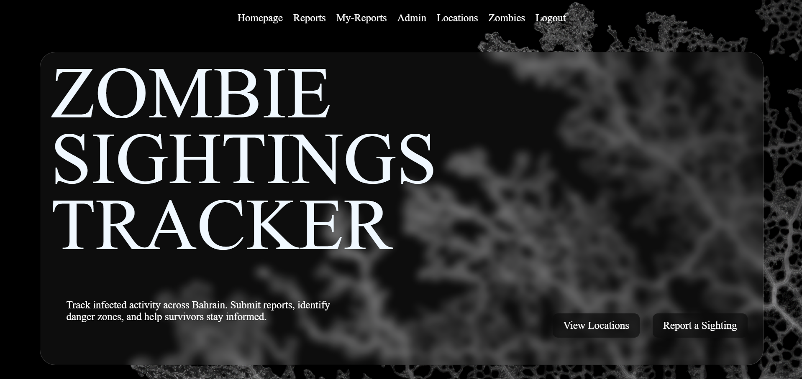
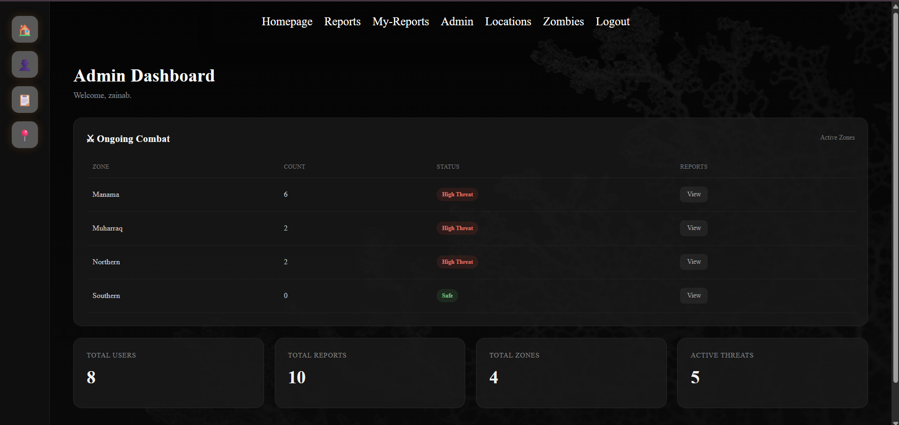
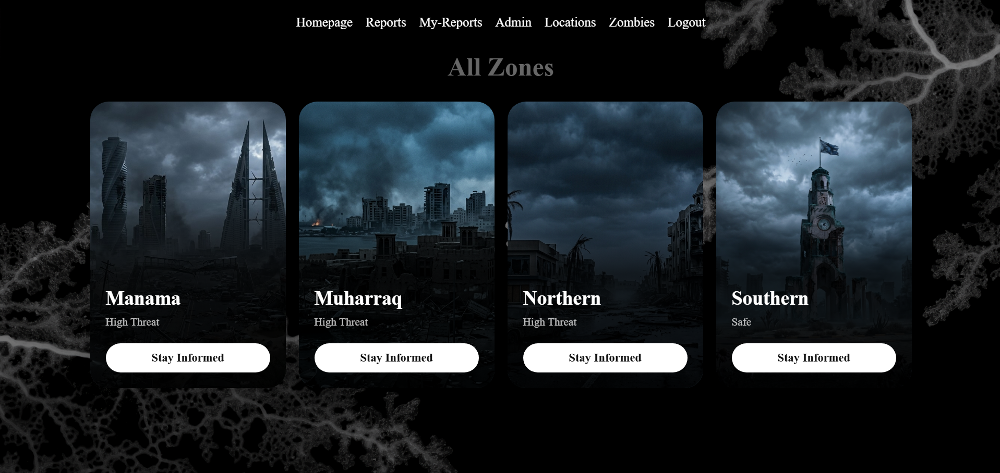
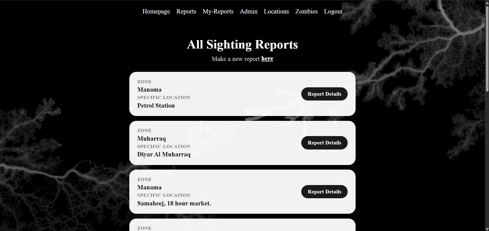

# ZOMBIE SIGHTINGS TRACKER

## Overview
A website where civilians, soldiers and other people can report a zombie sighting and stay informed and safe. 

# User Stories

## Authentication
As a visitor, I want to sign up so I can create an account.
As a user, I want to sign in and get access to protected features.
As a user, I want to be able to sign out so I can secure my account.

## Reports / Sightings
As a user, I want to submit a zombie sighting report so I can inform others about an outbreak.
As a user, I want to view all sighting reports so I can know where zombie activity has been reported.
As a user, I want to view a specific report so I can see its details.
As a user, I want to edit my own report so I can correct or update information.
As a user, I want to delete my own report so I can remove a report I no longer want displayed.

## Locations
As a user, I want to view known locations so I can see where reports are occurring.
As a user, I want to view details about a location so I can understand its current situation.
As a user, I want to create new locations when reporting a sighting in a location that doesn't already exist.
As a user, I want to update locations when their information changes.

## Zombie Information
As a user, I want to browse the different zombie types so I can identify the infected I encounter.
As a user, I want to see information about each zombie type so I can understand its threat level.

## Profile
As a user, I want to manage my profile information, including my occupation and contact information.

## Admin
As an admin, I want to manage users so I can maintain the integrity of the system.
As an admin, I want to remove inappropriate or false reports so that unreliable information doesn't remain on the tracker.

## Technologies Used
* CSS
* JavaScript
* EJS
* Node.js
* Express

## Screenshots

### Homepage

### Admin Dashboard

### Zones Page

### All Reports Page

## Getting Started

## Database Design

## Routes

| Method | Route                 | Description                                |
| ------ | --------------------- | ------------------------------------------ |
| GET    | `/`                   | Home page                                  |
| GET    | `/locations`          | View all zones                             |
| GET    | `/locations/:zone`    | View a specific zone and its sightings     |
| GET    | `/sightings`          | View all zombie sightings                  |
| GET    | `/sightings/new`      | New sighting form                          |
| POST   | `/sightings`          | Create a new sighting                      |
| GET    | `/sightings/:id`      | View a specific sighting                   |
| GET    | `/sightings/:id/edit` | Edit sighting form                         |
| PUT    | `/sightings/:id`      | Update a sighting                          |
| DELETE | `/sightings/:id`      | Delete a sighting                          |
| GET    | `/users/signup`       | Sign-up form                               |
| POST   | `/users/signup`       | Create a user account                      |
| GET    | `/users/login`        | Login form                                 |
| POST   | `/users/login`        | Log in                                     |
| GET    | `/users/logout`       | Log out                                    |
| GET    | `/admin`              | Admin dashboard                            |

## Features
- download reports as a PDF.
- Admin Dashboard.
- Role management.
- Animations.

## Future Enhancements
- Users page where admin(s) can give or revoke certain  privilages.
- Date and time for when reports were made-admin dashboard.
- Diagram that shows zones' reports percentage of all reports.
- redesign the threat lvl on the cards in the zones page.
- Users page:
    | GET    | `/admin/users`        | View users- future feature                 |
    | PUT    | `/admin/users/:id`    | Update user/admin status- future feature   |
    | DELETE | `/admin/users/:id`    | Soft-delete user- future feature           |

## Credits
- mold background images (https://www.naughtydog.com).
-  